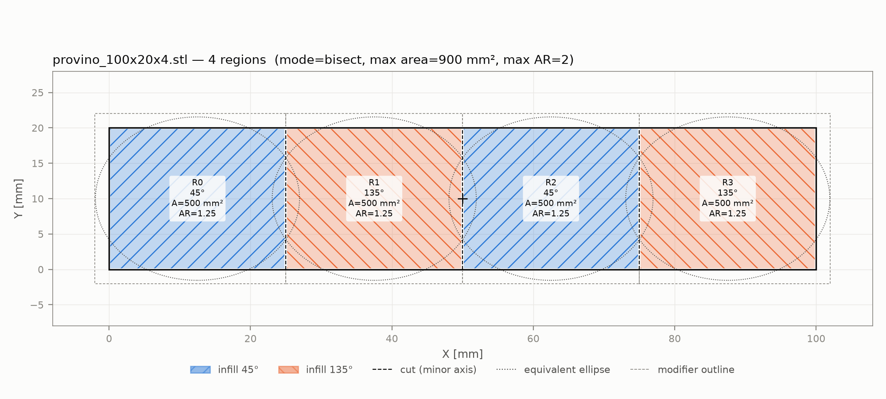
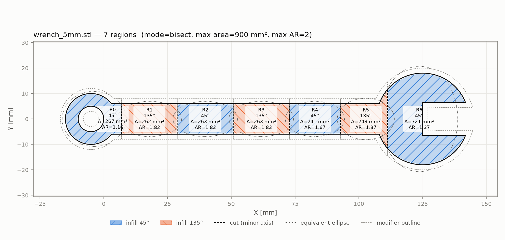

# prova_bricking: sezionamento dell'infill contro il warping

Implementazione in Python del criterio di sezionamento dell'infill proposto da
**Shen, Veeramani, Qin (2026)**, *"Warpage mitigation through infill sectioning in
fused filament fabrication"*, IISE Transactions 58(1):57-69.

Il programma legge un modello 3D di un pezzo **2.5D** (sezione costante lungo Z:
piastre, provini, chiavi) in formato STL o STEP e fa quanto segue:

1. estrae la sagoma XY (footprint) del pezzo;
2. ne calcola i momenti d'immagine: area, baricentro, assi principali ed ellisse
   equivalente, con aspect ratio AR = asse maggiore / asse minore;
3. biseca ricorsivamente la sagoma **lungo l'asse minore, passando per il
   baricentro**, finché ogni sotto-regione ha `area ≤ max_area` **e** `AR ≤ max_ar`;
4. assegna a regioni adiacenti angoli di infill alternati (45°/135°);
5. scrive un report JSON, un'immagine PNG di controllo e **un file STL per ogni
   sotto-regione**, da usare come *modifier* in Bambu Studio;
6. con `--export-3mf`, scrive anche un **progetto Bambu Studio (.3mf) pronto**:
   pezzo e modifier già assemblati, modifier già di tipo "Modifier" e
   `infill_direction` già impostato (45°/135° alternati).




---

## Installazione

```bash
python -m venv .venv && source .venv/bin/activate      # Windows: .venv\Scripts\activate
pip install -r requirements.txt
pip install cadquery-ocp         # solo per leggere file STEP (kernel OpenCascade)
```

Serve Python ≥ 3.10. `cadquery-ocp` è opzionale: senza, lo script funziona
comunque su STL, OBJ, PLY, 3MF e simili.

## Uso

```bash
python section_infill.py provino.stl --max-area 900 --max-ar 2.0 --out-dir ./output
python section_infill.py provino.step --out-dir ./output          # STEP (richiede cadquery-ocp)
```

| Opzione | Default | Significato |
|---|---|---|
| `--max-area` | 900 | area massima di una sotto-regione [mm²] |
| `--max-ar` | 2.0 | aspect ratio massimo dell'ellisse equivalente |
| `--mode` | `bisect` | `bisect` è il metodo di Shen et al.; `nsplit` è **sperimentale** (vedi sotto) |
| `--angles A1 A2` | 45 135 | i due angoli di infill da alternare [°] |
| `--margin-xy` | 2.0 | di quanto i modifier sporgono oltre le pareti esterne del pezzo [mm] |
| `--margin-z` | 1.0 | di quanto i modifier sporgono sopra il pezzo [mm] |
| `--footprint` | `projection` | `projection` = ombra della mesh su XY; `section` = sezione a metà altezza |
| `--min-area` | 1.0 | sotto quest'area [mm²] non si biseca più (blocco di sicurezza) |
| `--max-depth` | 12 | profondità massima di ricorsione |
| `--step-tolerance` | 0.05 | deflessione lineare della tassellazione STEP [mm] |
| `--raster-pixel` | 0.1 | pixel [mm] per il controllo dei momenti con `cv2.moments` (0 = salta) |
| `--prefix` | nome file | prefisso dei file di output |
| `--export-3mf` | | scrive anche il progetto Bambu Studio `<prefix>.3mf` |
| `--template-3mf` | | progetto `.3mf` salvato da Bambu Studio da cui copiare stampante, filamento e processo |
| `--3mf-setting KEY=VALUE` | | override aggiuntivo per ogni modifier nel `.3mf`, ripetibile |
| `--no-stl`, `--no-png` | | non scrive gli STL / il PNG |

Per generare dei pezzi di prova (provino 100×20×4, L, piastra forata, chiave):

```bash
python examples/make_test_parts.py
python section_infill.py examples/parts/provino_100x20x4.stl --out-dir output
```

### Output

Con `--out-dir output` e input `provino.stl`:

| File | Contenuto |
|---|---|
| `provino_sections.json` | parametri, momenti del pezzo, verifica vettoriale/raster dei momenti; per ogni regione: poligono, bbox, area, AR, baricentro, angolo, profondità, percorso di bisezione, vicini, STL del modifier |
| `provino_sections.png` | sagoma, regioni colorate e tratteggiate secondo l'angolo, tagli, ellissi equivalenti, contorni dei modifier |
| `provino_modifier_00_45deg.stl`, … | un prisma per ogni regione, **nello stesso sistema di coordinate del pezzo**. Il numero è l'id della regione, il suffisso è l'angolo da assegnare |
| `provino.3mf` | (solo con `--export-3mf`) progetto Bambu Studio con pezzo + modifier configurati |

Sul provino 100×20 mm con le soglie di default:

```
4 regions, all within thresholds: True
  R0  angle=   45°  area=   500.00 mm²  AR= 1.25  bbox=[0.0, 0.0, 25.0, 20.0]
  R1  angle=  135°  area=   500.00 mm²  AR= 1.25  bbox=[25.0, 0.0, 50.0, 20.0]
  R2  angle=   45°  area=   500.00 mm²  AR= 1.25  bbox=[50.0, 0.0, 75.0, 20.0]
  R3  angle=  135°  area=   500.00 mm²  AR= 1.25  bbox=[75.0, 0.0, 100.0, 20.0]
```

La sequenza è 100×20 (A = 2000, AR = 5) → 2 × 50×20 (A = 1000 > 900, AR = 2,5 > 2)
→ 4 × 25×20 (A = 500, AR = 1,25). Su una regione che resta connessa la bisezione
produce sempre 2ⁿ parti per ramo, come nei casi studio del paper (cap: 4, wrench: 8).

---

## Come funziona (dettagli utili per la tesi)

**Sagoma.**
- **STL:** i triangoli non verticali della mesh vengono proiettati su XY e uniti
  con shapely (`union_all`). Fori interni e parti multiple vengono gestiti.
- **STEP:** il B-rep viene letto con OpenCascade (`cadquery-ocp`), tassellato
  (`BRepMesh_IncrementalMesh`) e poi segue la stessa pipeline dell'STL.
- Con `--footprint section` la sagoma è invece la sezione della mesh a metà
  altezza. Su un pezzo 2.5D i due metodi coincidono (c'è un test che lo verifica).

**Momenti.**
- Sono calcolati in modo esatto sul poligono (teorema di Green, fori inclusi).
- Dalla matrice di covarianza `[[μ20, μ11], [μ11, μ02]] / A` si ricavano gli
  autovalori λ1 ≥ λ2. Gli assi principali sono gli autovettori, i semiassi
  dell'ellisse equivalente sono `a = 2√λ1` e `b = 2√λ2`, e `AR = √(λ1/λ2)`.
  Per un rettangolo w×h questo dà esattamente AR = w/h.
- Come controllo indipendente, la sagoma viene anche rasterizzata e analizzata
  con `cv2.moments`. Il confronto finisce nel JSON (`part.moments_check`).

**Bisezione.** Una regione viene tagliata se `area > max_area` **oppure**
`AR > max_ar`. Le disuguaglianze sono strette: una regione con AR = 2,0
esatto va bene. Il taglio è la retta perpendicolare all'asse maggiore (cioè
lungo l'asse minore) passante per il baricentro. Il procedimento si ripete su
entrambe le metà.
- Se un taglio divide una metà in pezzi non connessi (per esempio tagliando una
  U), ogni pezzo diventa una regione a sé e prosegue indipendentemente.
- `--min-area` e `--max-depth` servono da blocchi di sicurezza. Le regioni che si
  fermano per questi limiti vengono marcate `within_thresholds: false` nel JSON e
  con "(!)" nel PNG.

**Angoli.**
- Due regioni sono adiacenti se condividono un tratto di bordo (> 0,01 mm). Il
  contatto in un solo punto non conta.
- Gli angoli si assegnano colorando con 2 colori il grafo di adiacenza (ricerca
  esaustiva fino a 16 regioni, euristica oltre).
- Con giunzioni a T il grafo può contenere cicli dispari. In quel caso non esiste
  un'alternanza perfetta: il programma sceglie l'assegnazione che minimizza la
  lunghezza di bordo condivisa tra regioni con lo stesso angolo e la riporta in
  `summary.adjacency_conflicts`.

**Modifier STL.**
- Ogni modifier è il prisma della regione, allargato di `--margin-xy` **solo sui
  lati esterni** del pezzo. Sui lati di taglio i modifier si toccano esattamente
  lungo la linea di taglio, senza sovrapporsi. Insieme coprono tutto il pezzo
  (anche questo è verificato dai test).
- In Z vanno dalla base del pezzo a `top + margin-z`. **Non si estendono sotto la
  base**: lì non si stampa nulla, e un modifier sotto il piano potrebbe falsare il
  posizionamento dell'oggetto in Bambu Studio quando lo appoggia sul piatto.

**Modalità `--mode nsplit` (SPERIMENTALE, non è il metodo di Shen et al.).**
Divide la sagoma in N fasce di uguale larghezza lungo l'asse maggiore, con N
minimo che rispetta le soglie. Sul provino 100×20 dà 3 fasce da 33,3 mm
(AR 1,67). Serve solo come confronto nel piano DOE. Il JSON lo segnala nel campo
`method`.

## Test

```bash
python -m pytest -q
```

I test coprono:
- momenti analitici del rettangolo e confronto vettoriale/raster su rettangolo,
  L, piastra forata, chiave e rettangolo ruotato;
- **il caso di riferimento 100×20 → 4 regioni da 25×20 mm (A = 500, AR = 1,25),
  angoli 45/135/45/135**;
- invarianza per rotazione, soglie come disuguaglianze strette, strisce lunghe
  (8 regioni);
- partizione esatta (nessuna area scoperta o sovrapposta) su forme generiche;
- copertura dei modifier;
- pipeline completa STL → JSON/PNG/STL;
- lettura STEP, saltata se `cadquery-ocp` non è installato;
- export `.3mf`: confronto con un progetto salvato a mano da Bambu Studio 2.08
  (`tests/data/bambu_reference_provino.3mf`). Devono coincidere trasformazioni,
  posizione sul piatto, geometria vertice per vertice e impostazioni di
  stampante/filamento. I modifier devono avere tipo `modifier_part` e
  l'`infill_direction` corretto. C'è anche una lettura di controllo con
  `lib3mf` (la libreria di riferimento del consorzio 3MF), se installata
  (`pip install lib3mf`).

---

## Import in Bambu Studio, passo per passo

> **Nota.** I nomi dei menu qui sotto si riferiscono a Bambu Studio 2.08 e
> possono cambiare leggermente tra versioni. La verifica decisiva è sempre
> l'anteprima dopo lo slicing.

### Metodo 0 (consigliato): progetto `.3mf` generato automaticamente

1. Prepara una volta sola un **progetto modello** con la stampante, il filamento e
   il processo della campagna sperimentale (es. H2D + PA6). In Bambu Studio
   imposta i preset e salva con **File → Save Project As…**. Il file deve essere
   `.3mf`, **non** `.gcode.3mf`.
2. Genera il progetto:
   ```bash
   python section_infill.py provino.stl --out-dir output --export-3mf \
       --template-3mf modello_H2D_PA6.3mf \
       --3mf-setting sparse_infill_pattern=zig-zag --3mf-setting sparse_infill_density=100%
   ```
   Ogni modifier riceve `infill_direction` (45 o 135) più gli override passati
   con `--3mf-setting`. Le chiavi sono quelle di configurazione di Bambu Studio,
   per esempio `sparse_infill_pattern`, `sparse_infill_density`,
   `infill_direction`. Senza `--template-3mf` il progetto non contiene
   impostazioni di stampa e Bambu Studio usa i preset selezionati in quel momento.
3. Apri `output/provino.3mf` in Bambu Studio (File → Open Project).
4. Controlla nella lista oggetti che le parti `…_modifier_XX_…` abbiano l'icona
   dei **modifier**, e che ognuna mostri l'override della direzione. Poi fai lo
   slice e controlla l'anteprima.

Il programma avvisa se il pattern di infill sparso in uso (quello del template o
del `--3mf-setting`) non stampa una sola direzione per layer, per esempio Grid.

### Metodo A: caricare pezzo e modifier insieme come oggetto multi-parte

Questo metodo conserva **esattamente** le posizioni relative, perché tutti gli STL
sono nello stesso sistema di coordinate.

1. **File → Import → Import 3MF/STL/STEP…** (Ctrl+I). Seleziona **insieme** il
   file del pezzo (es. `provino.stl`) e tutti i `provino_modifier_XX_*deg.stl`.
2. Alla domanda *"Multi-part object detected… Load these files as a single object
   with multiple parts?"* rispondi **Sì**. Ottieni un solo oggetto con N+1 parti
   nella lista oggetti.
3. **Passaggio obbligatorio:** nella lista oggetti, per ogni parte
   `…_modifier_XX_…` fai tasto destro → **Change type** → **Modifier**. Il pezzo
   vero resta "Part".
   > ⚠️ Se salti questo passaggio, i "modifier" restano **parti solide** e vengono
   > stampati: il pezzo diventa 104×24×5 mm invece di 100×20×4, perché i modifier
   > sporgono di 2 mm per lato e 1 mm sopra. È successo nel primo progetto di
   > prova: nel `.3mf` le parti risultavano `subtype="normal_part"` e il piatto
   > slicato misurava 104×24 mm.
4. Per ogni modifier, imposta la direzione dell'infill:
   - seleziona il modifier nella lista oggetti, poi tasto destro → **Add settings**
     (o l'icona per aggiungere parametri) → categoria **Strength**, oppure cerca
     "direction";
   - imposta la direzione dell'infill (chiave di configurazione
     `infill_direction`) al valore indicato nel nome del file (45 o 135).
     Impostala **esplicitamente anche a 45°**: se in futuro cambi la direzione
     globale del processo, i modifier lasciati al default la seguirebbero;
   - in Bambu Studio 2.08 non esiste una direzione separata per l'infill solido:
     nel G-code di prova anche gli strati pieni (bottom, internal solid, top)
     seguivano `infill_direction` di ogni modifier.
5. **Slice** e controlla l'anteprima layer per layer: nelle regioni adiacenti le
   linee d'infill devono risultare ortogonali tra loro.

### Metodo B: aggiungere i modifier a un oggetto già caricato

1. Importa solo il pezzo.
2. Tasto destro sull'oggetto → **Add modifier** → **Load…** e scegli uno o più
   `…_modifier_XX_…stl`.
3. Controlla la posizione del modifier. A seconda della versione, Bambu Studio
   potrebbe riposizionare il modifier caricato invece di mantenere le coordinate
   originali. Nel JSON, `modifier_center_offset_from_part_center_mm` riporta per
   ogni modifier lo spostamento (X, Y, Z) del centro della sua bounding box
   rispetto al centro di quella del pezzo. Usalo per correggere la posizione nel
   pannello di manipolazione, oppure passa al metodo A.
4. Controlla che il tipo sia "Modifier" e imposta la direzione dell'infill come
   ai punti 3–4 del metodo A.

### Avvertenze

- **Non ruotare il pezzo sul piatto dopo aver assegnato gli angoli.** La direzione
  dell'infill in Bambu Studio è riferita agli assi del piatto, non al pezzo: se
  ruoti l'oggetto di 90°, 45° e 135° si scambiano rispetto al pezzo. Se ti serve
  un'orientazione diversa, ruota il modello in CAD, riesporta e rigenera.
- **Non usare il pattern Grid per l'infill sparso.** Grid stampa sia +45° sia
  −45° su ogni layer, quindi ruotarlo di 90° dà lo stesso identico disegno e
  l'alternanza 45°/135° tra regioni non ha alcun effetto. L'ho verificato sul
  G-code di un test reale (Bambu Studio 2.08, Grid 15%): negli strati sparsi
  tutte e 4 le regioni avevano linee a 45° e 135° in parti uguali. Negli strati
  pieni (bottom, internal solid, top) invece le regioni alternavano correttamente
  45/135/45/135, con rotazione di 90° a ogni layer. Per l'infill sparso usa un
  pattern a linee singole, per esempio Zig-zag o Rectilinear, da fissare nel DOE.
  Controlla sempre nell'anteprima.
- Con i pattern a linee singole che ruotano di 90° a ogni layer (come i solidi
  qui sopra), due regioni a 45° e 135° restano in opposizione di fase su *ogni*
  layer, che è l'alternanza cercata. *Aligned rectilinear* invece non ruota tra
  i layer: le regioni restano comunque a 45° e 135°, ma l'orientazione di ogni
  regione è la stessa su tutti i layer. È un'altra condizione sperimentale.
- I modifier cambiano solo i parametri che imposti. Pareti, top e bottom seguono
  le impostazioni dell'oggetto, a meno di aggiungere altri override.

---

## Come è costruito il `.3mf`

Il formato è stato ricavato da un progetto salvato da Bambu Studio 2.08
(`tests/data/bambu_reference_provino.3mf`, da cui è stato rimosso l'id
dell'account Bambu). Ogni dettaglio è stato verificato sui sorgenti di Bambu
Studio: `ModelVolume::type_from_string` in `src/libslic3r/Model.cpp` e
l'importer `_BBS_3MF_Importer` in `src/libslic3r/Format/bbs_3mf.cpp`.
- un oggetto con componenti in `3D/3dmodel.model`, e una mesh per parte in
  `3D/Objects/object_1.model`, centrata sulla propria bounding box;
- in `Metadata/model_settings.config`, ogni parte ha `subtype="normal_part"`
  (pezzo) oppure `subtype="modifier_part"` (modifier). Ogni altro
  `<metadata key=… value=…>` della parte viene caricato come override di quella
  parte, per esempio `infill_direction`;
- Bambu Studio tratta il file come progetto proprio solo se il metadato
  `Application` inizia con `BambuStudio-`. Il valore viene copiato dal template;
- `Metadata/project_settings.config`, cioè stampante, filamento e processo, viene
  copiato così com'è dal template.
- dal template vengono copiati anche i metadati del piatto, in particolare
  `filament_map_mode` e `filament_maps`, cioè la mappatura filamento→ugello
  necessaria per stampanti a due ugelli come l'H2D, e i file ausiliari
  (`filament_sequence.json`, intestazione di `slice_info.config`). Vengono
  generate le miniature del piatto (`plate_1.png`, `plate_1_small.png`). A parte
  le miniature e gli identificativi, il file ha la stessa struttura di un
  progetto salvato da Bambu Studio.

## Struttura

```
section_infill.py              CLI
infill_sectioning/
  footprint.py                 lettura STL/STEP ed estrazione della sagoma XY
  moments.py                   momenti esatti (Green) e raster (cv2.moments)
  sectioning.py                bisezione ricorsiva, nsplit, adiacenza, angoli, modifier
  export.py                    JSON, PNG, STL
  bambu3mf.py                  progetto Bambu Studio (.3mf)
tests/test_sectioning.py       test (pytest)
tests/test_bambu3mf.py         test dell'export .3mf
tests/data/                    progetto di riferimento salvato da Bambu Studio
examples/make_test_parts.py    pezzi di prova procedurali
```
